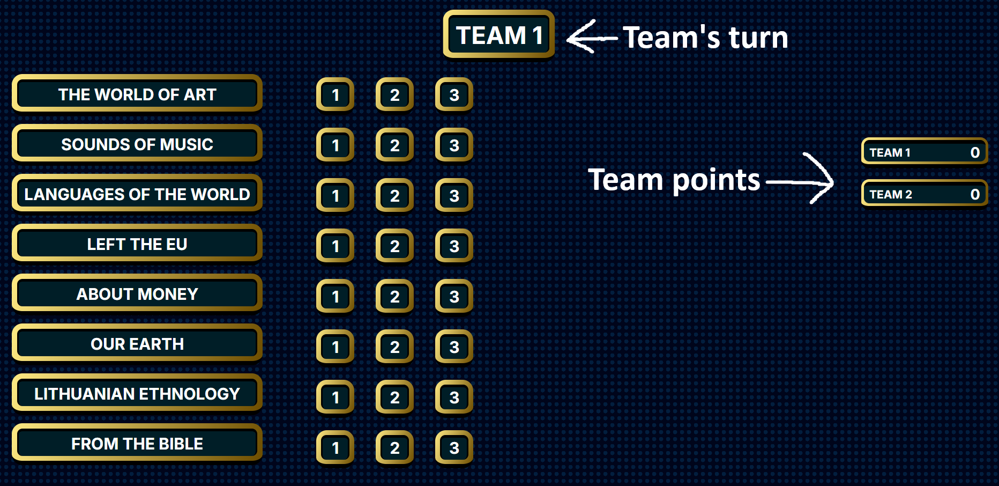

# Quiz Game — school project (2024)

**Status:** archived — this was built for a local school event in 2024.
**Maintenance:** I will **not** return to this project; no further changes will be made.
**Stability:** experimental — contains known bugs and rough edges.

## High-level summary

A simple browser-based quiz/game designed for an in-person event (projector + one controller). The controller runs the game UI and reads questions aloud; teams answer verbally. The repository contains a playable quiz (`quizzes/quiz1.csv`) and a `quizzes/template.csv` you can use to make new quizzes.

> [!WARNING]
> Some questions in `quizzes/quiz1.csv` can only be guessed (data issue).

## Requirements

* One person acting as the **controller** (operates the UI).
* At least 2 teams (Can be played solo).
* A projector or screen showing the controller’s browser.

## How to install

1. Clone or download the repo.

## Getting started

1. Open `index.html`.
2. Choose a quiz CSV from the `quizzes/` folder.
3. Enter a team name and click **Add** — repeat for each team.
4. When teams are ready, press **Play** to begin.

> [!IMPORTANT]
> The controller must start each question timer by pressing `Enter`. The timer will not start automatically.

## UI overview

Right side: team points. Top: current team name / turn indicator.

## Gameplay details

### Game 1 — Jeopardy-style

* The active team selects a **point value** from one of the categories (1–3).
* A panel opens with a question, answers, and a timer. Exactly one answer is correct.
* Correct answer: team gains the chosen points. Incorrect answer: **no** penalty.
* After a question is answered, it becomes unavailable. The correct answer is shown after the attempt; if the team answers incorrectly, the UI will show which answer was correct and which was given.
* If the timer runs out, the controller may still click an answer (useful if the team answered right before the timer finished and the controller didn't have enough time to click on the answer). If nobody answered, press `Enter` to continue without revealing the result.
* Each team answers **3 questions** in this game. After all teams finish, the leaderboard is shown and moves on to Game 2.

### Game 2 — Category challenge

* The active team chooses a category (categories do **not** determine point value).
* The controller displays the question, then presses `Enter` when the team is ready to start the timer.
* UI elements for this round: two answer options, a timer, and a changing word/phrase.
* Each category contains **20 questions**. Points are represented by small bars (bottom-left): empty = can be lost; gold = locked (cannot be lost).

  * To lock a bar you need **3 correct answers**. Getting 1-2 correct then 1 wrong will lose the progress.
* A category can be played **once per team**. After every team completes a category, the leaderboard displays and game moves on to the final round.

### Game 3 — Group round (no turns)

* All teams participate simultaneously. Format: “words after changing one letter.” 4 blocks of clues with hidden answers, each revealed by clicking them.
* If no one answers, the controller may reveal one of the answers (don’t award points for revealed answers).
* The controller must manually add points for correct answers by clicking a team’s score (the game will not auto-award).
* After both words of a group are revealed/handled, press `Enter` to continue to the next group.

### Game over

Final leaderboard is shown with total points.

> [!CAUTION]
> Do **not** press `Enter` after the final leaderboard — it will incorrectly append points to every team.

## Controls / Keys

* `Enter` — continue / start timer.
* Left mouse click (on a team’s score) — **add** one point to that team.
* Middle mouse click (on a team’s score) — **remove** one point from that team.

## Files

* `index.html` — entry point.
* `quizzes/quiz1.csv` — default quiz data used by the game.
* `quizzes/template.csv` — CSV template for creating custom quizzes.

> [!NOTE]
> This was developed quickly for a live event. It is preserved here for historical value only.

#### This project is licensed under the Unlicense license. See the `LICENSE` file for details.
